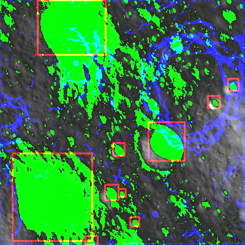

# Hazard_Map

## Project Overview

**Project Name:** Hazard_Map  
**Author:** Pirate-Emperor

## Description

Hazard_Map is a comprehensive repository developed by Pirate-Emperor that focuses on combining the outputs of various lunar models, including Slope, Shadow, Crater Maps, and Hazard Map. This project aims to provide a unified and detailed hazard map for lunar terrain exploration. Hazard maps are crucial for identifying potential risks and hazardous areas, aiding in mission planning and scientific research.

## Features

1. **Integration of Models:** Hazard_Map combines the outputs of the following models:
   - **Slope:** Provides slope maps derived from lunar terrain.
   - **Shadow:** Generates shadow maps based on lighting conditions and lunar features.
   - **Crater Maps:** Identifies and outlines impact craters on the lunar surface.
   - **Hazard_Map:** Integrates all available information to create a comprehensive hazard map.

2. **Comprehensive Hazard Mapping:** The project considers slope, shadow, and crater maps along with hazard information to generate a detailed hazard map for lunar exploration.

3. **Customizable Parameters:** Researchers and users can adjust parameters to customize risk assessments based on specific lunar exploration scenarios.

4. **Integration Support:** Hazard_Map provides APIs and integration support for seamless incorporation into lunar exploration applications and mission planning.

## Screenshots
### Slope

### Crater

### Shadow

### Hazard

### Combined

